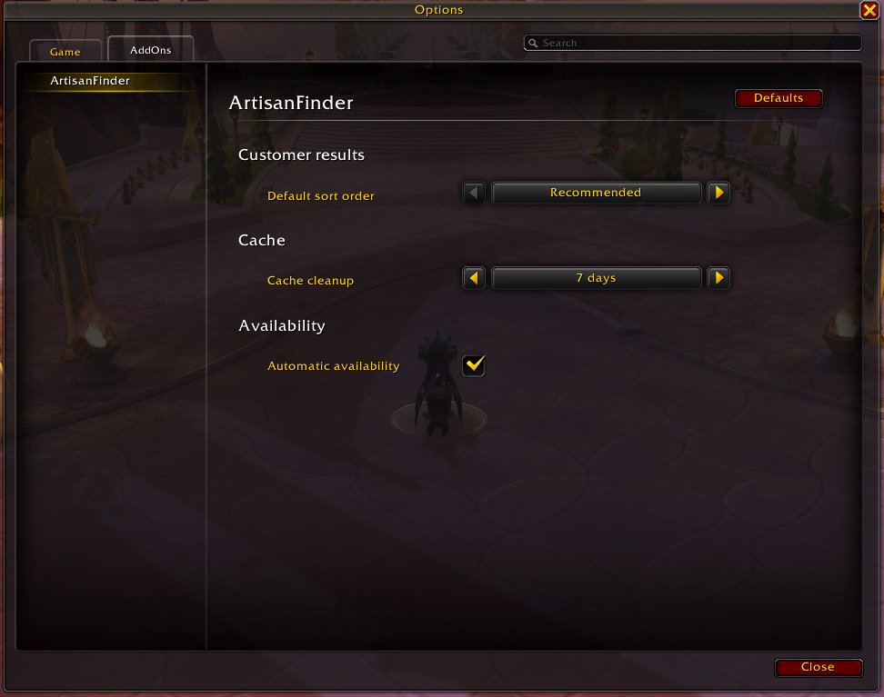

# ArtisanFinder

ArtisanFinder helps World of Warcraft players find available crafters directly from the Crafting Orders UI, while giving crafters a simple way to publish their prices, notes, quality expectations, reagent recommendations, and availability from the Professions UI.

The addon is built around a simple idea: customers should be able to find the right artisan for the item they are ordering, and crafters should be able to stay discoverable without constantly repeating the same message in trade chat.

## Features

*   Live artisan search from the Crafting Orders form.
*   Crafter availability toggles from the minimap button.
*   Optional automatic availability in trade-chat areas, with automatic disable when entering instances.
*   Item-specific and profession-default commissions and notes.
*   Favorite artisans that stay visible at the top of customer results.
*   Search and sorting for busy artisan lists.
*   Personal order field helper for recipient and commission review.
*   Profession-link opening from customer results.
*   Reagent recommendations with reagent icons in tooltips.
*   Temporary trade-chat profession leads for crafters who do not use the addon.
*   Background recipe scanning that resumes if the profession window closes.
*   Official Options -> AddOns configuration panel.
*   Localization for English, French, German, Spanish, Russian, and Chinese.

## For Customers

When you open the Crafting Order form and choose an item, ArtisanFinder checks for artisans who are currently available for that craft. Addon-enabled crafters only appear after they respond to the current search, so old cached results are not shown as if they were online.

The results help answer the questions that usually slow down personal orders:

*   Who can craft this item right now?
*   What commission are they asking for?
*   Did they leave any note about materials, recrafts, or special conditions?
*   What quality can they make with regular or recommended reagents?
*   Can I whisper them or prepare a personal order without copying their name by hand?

Each certified result can include the crafter's profession, commission, note, base craft quality, and recommended reagents when that information is available. You can search and sort the list when many artisans are available, mark favorite artisans, and use the row action button to whisper the crafter, open their profession link, or fill personal order fields for review.

ArtisanFinder can also notice profession links posted in trade chat. These crafters are shown as potential leads for matching professions for a short time, but they are not marked as certified addon data. They are useful when you want more crafters to contact, while addon-enabled results remain the source for exact prices, qualities, and reagent recommendations.

ArtisanFinder does not place orders for you. It only helps fill or open the right information so you can review everything before submitting an order yourself.

## For Crafters

ArtisanFinder adds lightweight controls to the Professions UI so you can keep your crafting information ready while using the normal Blizzard profession panel.

You can set:

*   An item-specific commission and note for a selected craft.
*   A default commission and note for the current profession.
*   Whether you are currently available to answer customer searches.

Item-specific values are useful when a craft is expensive, rare, or otherwise different from your usual pricing. Profession defaults are useful for everyday crafts where you want a standard commission and note.

Availability is session-based and resets off after login or reload, so you decide when you want to appear in customer searches. The minimap button gives you a quick way to toggle availability without digging through menus. If you prefer, automatic availability can mark you as available in capital or trade-chat areas and mark you unavailable when entering instances.

ArtisanFinder scans your known recipes in the background and resumes unfinished work later if the profession window closes. This keeps your craft data up to date while avoiding long freezes when opening a large profession. You can also force a fresh scan of the currently open profession with `/af scan`.

## Reagent Guidance

For addon-enabled crafters, ArtisanFinder can show suggested reagents for the selected craft. These recommendations are meant to answer a practical customer question: which reagent qualities should I provide to get the best useful result from this crafter?

Recommendations prefer lower-quality reagents when higher-quality reagents do not improve the result, and higher-quality reagents when they do. Reagent names and icons are shown directly in the customer tooltip, so you do not need to interpret item IDs or external notes.

## Commission Values

Commission fields use a single gold input:

*   `0`: unspecified commission.
*   `-1`: free commission.
*   Any positive number: commission in gold.

An item-specific commission takes priority over a profession default. If an item has no specific commission, the profession default can be used instead.

## Options

ArtisanFinder has an Options -> AddOns panel where you can configure:

*   Default customer result sorting.
*   Cache cleanup frequency.
*   Automatic availability mode.

## Languages

ArtisanFinder includes localization support for English, French, German, Spanish, Russian, and Chinese. Spanish also covers `esMX`, and Chinese also covers `zhTW`.

## Useful Commands

*   `/af scan`: force a fresh scan of the currently open profession.
*   `/af clear confirm`: clear ArtisanFinder's saved data.

## Inspiration

ArtisanFinder was inspired by the convenience of Easycraft.io and the in-game Dofus Artisan list, adapted for World of Warcraft's Crafting Orders and Professions UI.