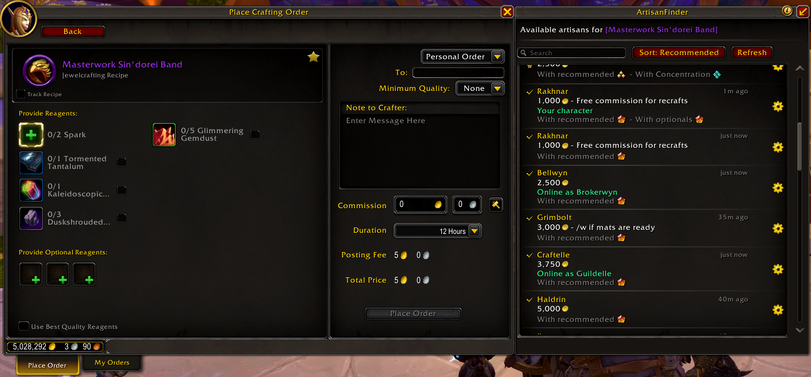
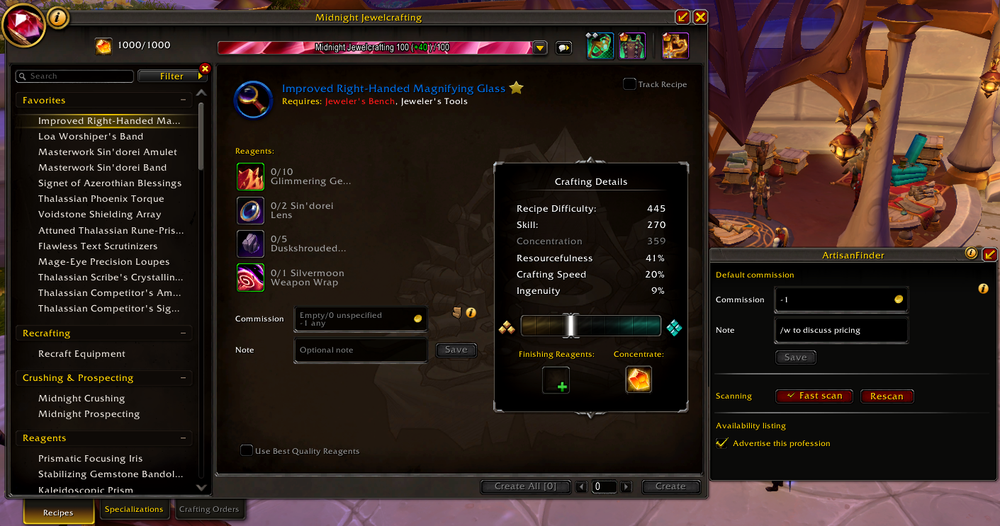
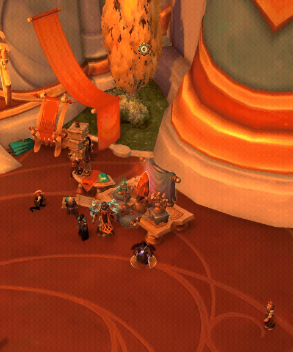
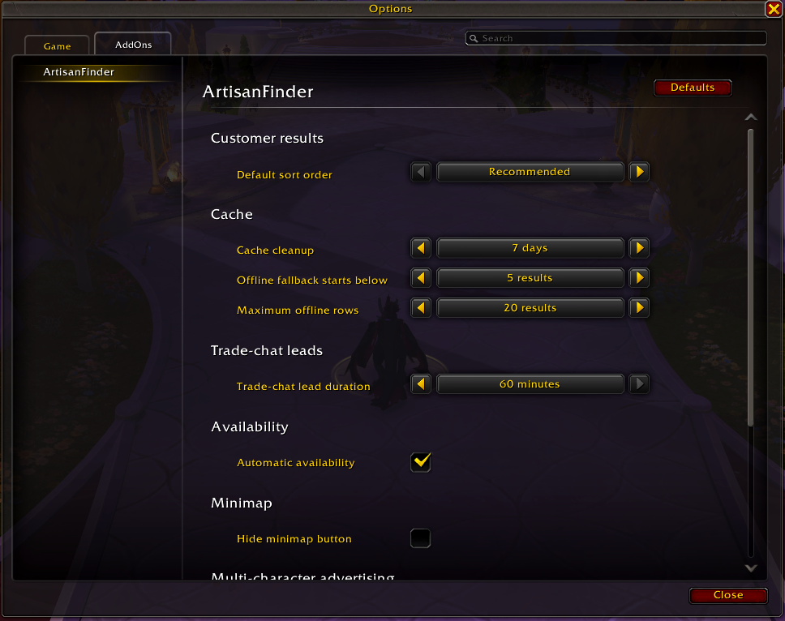
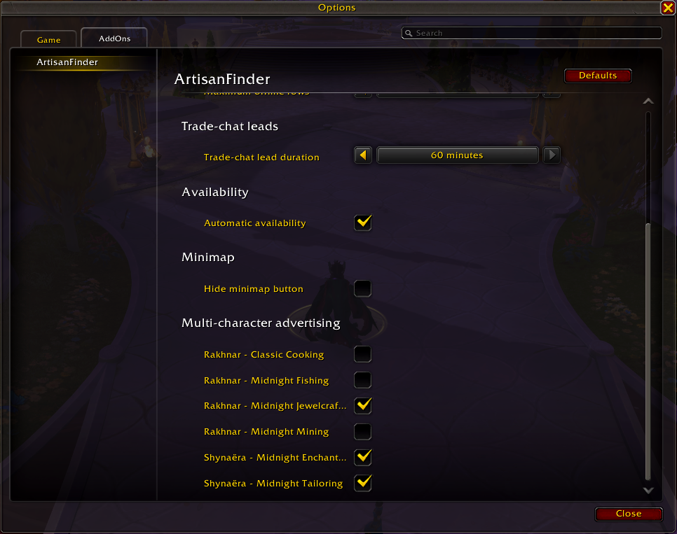

# ArtisanFinder

ArtisanFinder helps players find available crafters directly from the Crafting Orders UI, while giving crafters a simple way to publish prices, notes, quality expectations, reagent recommendations, and availability from the Professions UI.

## Features

*   Live artisan search from the Crafting Orders form.
*   Crafter profiles with commissions, notes, quality data, and suggested reagents.
*   Multi-character advertising for scanned professions from your alts.
*   Guild and trade-chat crafter discovery.
*   Favorites, search, sorting, online checks, and personal order helpers.
*   Personal order notifications for addon-enabled customers and artisans.
*   Manual recipe scanning for supported crafting professions, with optional automatic rescans.
*   Minimap, movable button, Options -> AddOns, and Blizzard Edit Mode controls.
*   Localization for English, French, German, Spanish, Russian, and Chinese.

## For Customers

When you choose an item in the Crafting Order form, ArtisanFinder shows matching artisans who can help with that craft. Results can include commission, note, quality with recommended or optional reagents, AFK state, guild source, trade-chat leads, and actions for whispering or preparing an order.

ArtisanFinder does not place orders for you. It only helps fill or open the right information so you can review everything before submitting an order yourself.

## For Crafters

### Quality, commissions and availability

ArtisanFinder adds lightweight controls to the Professions UI for item-specific and profession-default commissions, notes, and availability. It stores scanned profession data and can advertise scanned professions from your other characters while you are online. The crafter panel also includes a customer preview tooltip so you can check what customers will see.

Availability is session-based and resets after login or reload. You can cycle between unavailable, current-character availability, and account-wide availability from the minimap button, or let automatic availability enable it in trade-chat areas and disable it in selected instance types. Profession scans can refresh automatically by default, or you can disable automatic scans in options and press Rescan in the Professions UI when you want to refresh stored craft data.

### Notifications

If an addon-enabled customer places a personal order for one of your characters while you are on another character, ArtisanFinder can play your selected notification sound and show a loot-style notification with the item, customer, character, and commission. Notifications are remembered until cleared or completed, and the Blizzard crafting order minimap icon can also show known alt orders.

## Reagent Guidance

For addon-enabled crafters, ArtisanFinder can show suggested reagent qualities for the selected craft. Reagent names and icons appear directly in customer tooltips, with optional difficulty estimates when scan data is available.

## Commission Values

Commission fields use a single gold input:

*   Empty or `0`: unspecified commission.
*   `-1`: free commission.
*   Any positive number: commission in gold.

An item-specific commission takes priority over a profession default. If an item has no specific commission, the profession default can be used instead.

## Options

ArtisanFinder has an Options -> AddOns panel ordered around common controls first: minimap/button behavior, availability, scanning, trade-chat leads, order notifications, result sorting, cache behavior and advertised character professions. Blizzard Edit Mode controls the order notification toast and movable ArtisanFinder button placement.

## Languages

ArtisanFinder includes localization support for English, French, German, Spanish, Russian, and Chinese. Spanish also covers `esMX`, and Chinese also covers `zhTW`.

## Useful Commands

*   `/af`: shows help for ArtisanFinder commands.
*   `/af scan`: force a fresh scan of the currently open profession.
*   `/af auto`: show current automatic availability state.
*   `/af auto on`: enable automatic availability in trade-chat areas.
*   `/af auto off`: disables automatic availability.
*   `/af auto toggle`: toggles the auto availability mode.
*   `/af clear`: show clear data commands.

## Inspiration

ArtisanFinder was inspired by the convenience of Easycraft.io and the in-game Dofus Artisan list, adapted for World of Warcraft's Crafting Orders and Professions UI.

## Special thanks

I would like to thank a few people who made this project possible by their feedback, their help in testing, as well as their help in designing some of the assets of the project: **my sister** for the beautiful icons, **Foxas**, **Valkhes** and **Dolkian** for their thorough testing and search for bugs, and **Reiisal** for his input on the addon's accessibility, feedback and continuous support during this adventure.

## Third-Party Libraries

ArtisanFinder embeds several addon libraries under `Libs/`. Their license and notice information is listed in [THIRD_PARTY_NOTICES.md](THIRD_PARTY_NOTICES.md).
